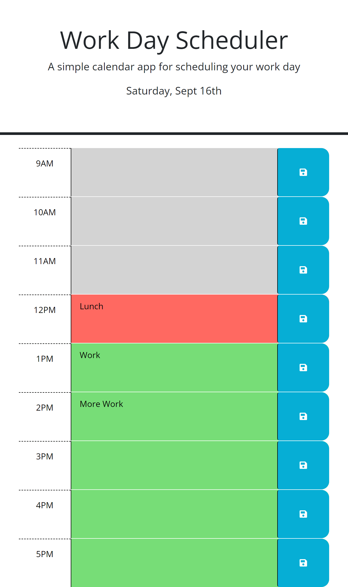

# MyWork_Day_Planner

#Description

Work_Day_Scheduler

For this challenge we were given starter code to create javascript using jquery 
and Day.js to create a scheduler that will update the time with event the user adds.
The event would need to be save after pressing the save button that would then store 
the event into local storage so when the user reloads the page the event would be saved. The properties that were needed were addClass(), parseInt(), .each(),.children(), and etc. 

#Mock_UP

#Usage

The user can use this to keep track of day to day tasks and use this for reminders. 
This application can be used to make a calender that will save the events for each date. Users can also implement weather or saving music and etc.

#Credits

Github-Deploy="https://ameridacas.github.io/MyWork_Day_Planner/"

Github-Repo="https://github.com/ameridacas/MyWork_Day_Planner"